# 🏙️ Bangalore Buzz - AI-Powered Civic Assistant

[](https://python.org)
[](https://flask.palletsprojects.com/)
[](https://cloud.google.com)
[](LICENSE)

**Bangalore Buzz** is an intelligent AI-powered civic assistance platform that helps Bengaluru citizens report city issues, discover local events, and interact with government services through natural conversation and image-based reporting.

## 🎬 Demo Video

[](https://youtu.be/6nHX2nX0nuY)

**🎥 Click the image above to watch the full demo!**

## 🌟 Features

- **🤖 AI-Powered Chat Interface** - Natural language conversation with Gemini AI
- **📸 Image-Based Reporting** - Upload photos to report civic issues automatically
- **🗑️ Waste Management** - Report garbage and sanitation issues with BBMP integration
- **🕳️ Road Maintenance** - Report potholes and road damage with location detection
- **⚡ Electrical Infrastructure** - Report street light and power issues with BESCOM integration
- **🎉 Event Discovery** - Find local events, meetups, and activities in Bengaluru
- **📱 Modern Web Interface** - Responsive design with drag-and-drop functionality
- **🔍 Report Tracking** - Track report status with unique IDs
- **☁️ Cloud-Native** - Google Cloud Storage and Firestore integration

## 🏗️ Architecture Overview

### System Architecture

```mermaid
graph TB
    subgraph "Frontend Layer"
        UI[Web Interface<br/>HTML/CSS/JS<br/>Chat + Image Upload]
    end
    
    subgraph "Application Layer"
        Flask[Flask Web Server<br/>REST API Endpoints<br/>Request Routing]
        Orchestrator[Orchestrator<br/>Intent Detection<br/>Agent Coordination]
    end
    
    subgraph "AI Processing Layer"
        Gemini[Google Gemini AI<br/>NLP + Image Analysis]
        
        subgraph "Specialized Agents"
            TrashAgent[Trash Agent<br/>🗑️ BBMP Integration]
            PotholeAgent[Pothole Agent<br/>🕳️ Road Issues]
            ElectricityAgent[Electricity Agent<br/>⚡ BESCOM Integration]
            EventsAgent[Events Agent<br/>🎉 Local Activities]
        end
    end
    
    subgraph "Data Layer"
        Firestore[(Firestore Database<br/>Reports & Tracking)]
        GCS[(Cloud Storage<br/>Image Storage)]
        CSV[(Local Data<br/>BBMP/BESCOM/Events)]
    end
    
    UI --> Flask
    Flask --> Orchestrator
    Orchestrator --> Gemini
    Orchestrator --> TrashAgent
    Orchestrator --> PotholeAgent
    Orchestrator --> ElectricityAgent
    Orchestrator --> EventsAgent
    Flask --> Firestore
    Flask --> GCS
    TrashAgent --> CSV
    PotholeAgent --> CSV
    ElectricityAgent --> CSV
    EventsAgent --> CSV
```



### Key Components

1. **Frontend Layer**: Modern web interface with chat and image upload capabilities
2. **Flask Application**: RESTful API server handling requests and responses
3. **Orchestrator**: Central intelligence hub for intent detection and routing
4. **AI Agents**: Specialized agents for different civic services
5. **Google Cloud Integration**: Firestore database and Cloud Storage
6. **Local Data Sources**: CSV files with government contact information

## 🔄 User Flow

### Primary User Journeys

```mermaid
flowchart TD
    Start([User Visits Bangalore Buzz]) --> Landing{Landing Page}
    
    Landing --> TextChat[💬 Text Chat]
    Landing --> ImageUpload[📸 Image Upload]
    Landing --> QuickAction[⚡ Quick Actions]
    
    TextChat --> IntentDetection[🎯 AI Intent Detection]
    IntentDetection --> GeneralChat[💬 General Response]
    IntentDetection --> EventSearch[🎉 Event Discovery]
    IntentDetection --> ReportRequest[📋 Report Request]
    
    ImageUpload --> ImagePreview[👁️ Preview & Actions]
    QuickAction --> ImageCheck{📸 Image Required?}
    ImageCheck -->|No Image| PromptUpload[📤 Request Upload]
    ImageCheck -->|Has Image| ProcessReport[📋 Process Report]
    ImagePreview --> ProcessReport
    ReportRequest --> ProcessReport
    
    ProcessReport --> AgentSelection{🤖 Select Agent}
    AgentSelection --> TrashWorkflow[🗑️ Trash Agent<br/>GPS + BBMP Lookup]
    AgentSelection --> PotholeWorkflow[🕳️ Pothole Agent<br/>Road Assessment]
    AgentSelection --> ElectricityWorkflow[⚡ Electricity Agent<br/>BESCOM Integration]
    
    TrashWorkflow --> StoreReport[💾 Store in Firestore]
    PotholeWorkflow --> StoreReport
    ElectricityWorkflow --> StoreReport
    
    EventSearch --> DisplayEvents[📅 Show Events]
    GeneralChat --> ShowResponse[💬 Display Response]
    StoreReport --> ShowReport[📋 Show Report + Tracking ID]
    
    DisplayEvents --> Continue{🔄 Continue?}
    ShowResponse --> Continue
    ShowReport --> Continue
    
    Continue -->|Yes| Landing
    Continue -->|No| End([Session Complete])
    
    PromptUpload --> ImageUpload
```



### Detailed Flow Steps

1. **Entry Point**: Users access the web interface
2. **Input Methods**: Text chat, image upload, or quick action buttons
3. **Intent Detection**: AI analyzes user input to determine the required service
4. **Agent Routing**: Specialized agents handle specific types of requests
5. **Data Processing**: Extract location, analyze images, lookup officials
6. **Report Generation**: Create formatted reports with contact information
7. **Storage**: Save reports to Firestore and images to Cloud Storage
8. **Response**: Display results with tracking IDs and next steps

## 🚀 Quick Start

### Prerequisites

- Python 3.9+
- Google Cloud account with billing enabled
- Gemini API key

### 1. Clone and Setup

```bash
# Clone the repository
git clone <your-repo-url>
cd ai-hackathon

# Create virtual environment
python -m venv venv
source venv/bin/activate  # On Windows: venv\Scripts\activate

# Install dependencies
pip install -r requirements.txt
```

### 2. Environment Configuration

```bash
# Create environment file
cp env_template.txt .env

# Edit .env with your credentials
nano .env
```

Required environment variables:
```env
GEMINI_API_KEY=your_gemini_api_key_here
GOOGLE_CLOUD_PROJECT_ID=your-project-id
GOOGLE_CLOUD_STORAGE_BUCKET=your-bucket-name
GOOGLE_APPLICATION_CREDENTIALS=./key1.json
```

### 3. Google Cloud Setup

1. **Create Google Cloud Project**
2. **Enable APIs**: Storage, Firestore, App Engine/Cloud Run
3. **Create Service Account** with Storage Admin + Firestore User roles
4. **Download key as `key1.json`**
5. **Create Storage Bucket**
6. **Initialize Firestore Database**

📖 **Detailed setup**: See [GOOGLE_CLOUD_SETUP.md](GOOGLE_CLOUD_SETUP.md)

### 4. Run Locally

```bash
# Start the application
python app.py

# Open browser to http://localhost:5500
```

## 🌐 Deployment

### Option 1: Google App Engine (Recommended)

```bash
# Quick deployment
./deploy_app_engine.sh
```

### Option 2: Google Cloud Run

```bash
# Container-based deployment
./deploy_cloud_run.sh
```

📖 **Detailed deployment**: See [DEPLOYMENT_GUIDE.md](DEPLOYMENT_GUIDE.md)  
⚡ **Quick reference**: See [QUICK_DEPLOY.md](QUICK_DEPLOY.md)

## 📚 API Documentation

### Core Endpoints

| Method | Endpoint | Description |
|--------|----------|-------------|
| `GET` | `/` | Web interface |
| `GET` | `/health` | Health check |
| `POST` | `/chat` | Text conversation |
| `POST` | `/analyze` | General analysis (text + optional image) |
| `POST` | `/report/trash` | Trash reporting (image required) |
| `POST` | `/report/pothole` | Pothole reporting (image required) |
| `POST` | `/report/electricity` | Electricity reporting (image required) |
| `GET` | `/report/<id>` | Retrieve report by ID |
| `PUT` | `/report/<id>/status` | Update report status |

### Example Usage

#### Text Chat
```bash
curl -X POST http://localhost:5500/chat \
  -H "Content-Type: application/json" \
  -d '{"message": "Hello, what can you help me with?"}'
```

#### Image-Based Reporting
```bash
curl -X POST http://localhost:5500/report/trash \
  -F "image=@garbage_sample.jpg"
```

#### Event Discovery
```bash
curl -X POST http://localhost:5500/chat \
  -H "Content-Type: application/json" \
  -d '{"message": "Show me tech events this weekend"}'
```

## 🧪 Testing

### Run Test Suite
```bash
# API testing
python test_api.py

# Frontend testing
python test_frontend.py

# Google Cloud configuration test
python setup_google_cloud.py
```

### Manual Testing
```bash
# Test individual agents
python trash_agent.py
python pothole_agent.py
python electricity_agent.py
python events_agent.py
```

## 📁 Project Structure

```
ai-hackathon/
├── 📱 Frontend
│   ├── templates/index.html      # Main web interface
│   └── static/style.css          # UI styling
├── 🚀 Application
│   ├── app.py                    # Flask web server
│   └── orchestrator.py           # Request orchestration
├── 🤖 AI Agents
│   ├── trash_agent.py            # Waste management
│   ├── pothole_agent.py          # Road maintenance
│   ├── electricity_agent.py      # Power infrastructure
│   └── events_agent.py           # Event discovery
├── 📊 Data
│   ├── bbmp.csv                  # BBMP officials data
│   ├── bescom.csv                # BESCOM officials data
│   └── events.csv                # Local events data
├── ☁️ Deployment
│   ├── app.yaml                  # App Engine config
│   ├── Dockerfile                # Cloud Run config
│   ├── deploy_app_engine.sh      # App Engine deployment
│   └── deploy_cloud_run.sh       # Cloud Run deployment
├── 🧪 Testing
│   ├── test_api.py               # API tests
│   ├── test_frontend.py          # Frontend tests
│   └── setup_google_cloud.py     # Cloud setup verification
└── 📖 Documentation
    ├── DEPLOYMENT_GUIDE.md       # Deployment instructions
    ├── GOOGLE_CLOUD_SETUP.md     # Cloud setup guide
    └── FRONTEND_GUIDE.md         # Frontend guide
```

## 🛠️ Technology Stack

### Backend
- **Python 3.9+** - Core programming language
- **Flask 3.0** - Web framework
- **Google Gemini AI** - Natural language processing and image analysis
- **Pandas** - Data processing and CSV handling
- **Pillow** - Image processing and EXIF data extraction

### Frontend
- **HTML5/CSS3** - Modern web standards
- **JavaScript (ES6+)** - Interactive functionality
- **Leaflet.js** - Interactive maps
- **Responsive Design** - Mobile-friendly interface

### Cloud Services
- **Google Cloud Firestore** - NoSQL database for reports
- **Google Cloud Storage** - Image and file storage
- **Google App Engine / Cloud Run** - Serverless hosting
- **Google Cloud Build** - CI/CD pipeline

### Data Sources
- **BBMP Officials Database** - Waste management contacts
- **BESCOM Officials Database** - Electrical utility contacts
- **Local Events Database** - Bengaluru events and activities

## 🔒 Security Features

- **Environment Variable Management** - Secure credential storage
- **File Upload Validation** - Safe image processing
- **Input Sanitization** - XSS and injection prevention
- **HTTPS Enforcement** - Secure communications
- **IAM Role-Based Access** - Fine-grained cloud permissions

## 📈 Monitoring & Analytics

- **Health Check Endpoint** - System status monitoring
- **Google Cloud Logging** - Comprehensive logging
- **Error Tracking** - Automated error reporting
- **Usage Analytics** - Report generation statistics
- **Performance Monitoring** - Response time tracking

## 🤝 Contributing

1. **Fork the repository**
2. **Create feature branch**: `git checkout -b feature/amazing-feature`
3. **Commit changes**: `git commit -m 'Add amazing feature'`
4. **Push to branch**: `git push origin feature/amazing-feature`
5. **Create Pull Request**

### Development Guidelines
- Follow PEP 8 coding standards
- Add tests for new features
- Update documentation
- Verify Google Cloud integration

## 🐛 Troubleshooting

### Common Issues

**"Application failed to start"**
- Check environment variables are set correctly
- Verify Google Cloud credentials
- Ensure all required APIs are enabled

**"Permission denied" errors**
- Verify service account has required roles
- Check Firestore security rules
- Confirm Storage bucket permissions

**Image upload issues**
- Verify bucket exists and is publicly accessible
- Check file size limits (16MB max)
- Ensure supported formats: PNG, JPG, JPEG, GIF

📖 **Full troubleshooting guide**: See [DEPLOYMENT_GUIDE.md](DEPLOYMENT_GUIDE.md#troubleshooting)

## 📞 Support

- **📧 Technical Support**: Create an issue in this repository
- **📖 Documentation**: Check the `/docs` folder for detailed guides
- **🔧 Setup Help**: Run `python setup_google_cloud.py` for configuration verification
- **💬 Community**: Join our discussions for tips and best practices

## 📜 License

This project is licensed under the MIT License - see the [LICENSE](LICENSE) file for details.

## 🙏 Acknowledgments

- **Google Cloud Platform** - Cloud infrastructure and AI services
- **BBMP & BESCOM** - Government data and service integration
- **Bengaluru Citizens** - Community feedback and testing
- **Open Source Community** - Libraries and frameworks used

---

## 🚀 **Ready to Get Started?**

1. **🔧 Setup**: Follow the [Quick Start](#quick-start) guide
2. **☁️ Deploy**: Use our [deployment scripts](#deployment)  
3. **📖 Learn**: Explore the [documentation](#api-documentation)
4. **🤝 Contribute**: Join our [development community](#contributing)

**Made with ❤️ for Bengaluru** 🏙️

---

*Bangalore Buzz - Connecting Citizens with City Services through AI* 